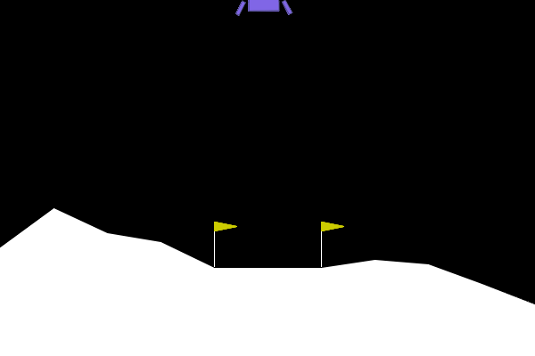
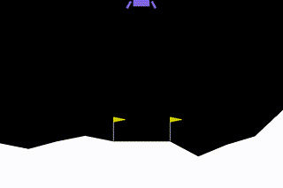

# AI Project: Lunar Lander

Please check [report](./ai_final_report.pdf) for more information!

## RL with QLearning

### Visual Results

#### After Training 20 Epochs


#### After Training 100 Epochs


### Test on 100 Epochs
```bash
mean: 225.14527054974315 std: 62.88393475576646 max: 299.080730952846 min: -91.00848452617487
```

### QLearing with self-designed Game
It is too difficult to solve, and here's our best result


## RL with ActorCritic

### Visual Results

#### After Training 200 Epochs


#### After Training 600 Epochs


#### After Training 1000 Epochs


### Test on 100 Epochs
```bash
mean: 90.56262718486646 std: 50.90599388292423 max: 196.7647751914238 min: -89.969924180479
```

## Offline learning with MLP

### A successful case:


### Test on 100 Epochs
```bash
mean: 228.52481574436288 std: 70.03703811274288 max: 295.4086650330729 min: -167.62464413445562
```
## Offline learning with BNN

### A successful case:


### Test on 100 Epochs
```bash
mean: 239.1624154306785 std: 39.08197482732056 max: 289.3384291423988 min: -13.772508972854709
```
## Reference

1. [https://aayala4.github.io/Lunar-Lander-Python/](https://aayala4.github.io/Lunar-Lander-Python/)
2. [https://zhuanlan.zhihu.com/p/97856004](https://zhuanlan.zhihu.com/p/97856004)
3. [https://rail.eecs.berkeley.edu/deeprlcourse-fa17/f17docs/lecture_5_actor_critic_pdf.pdf](https://rail.eecs.berkeley.edu/deeprlcourse-fa17/f17docs/lecture_5_actor_critic_pdf.pdf)
4. [https://blog.csdn.net/qq_33302004/article/details/115530428](https://blog.csdn.net/qq_33302004/article/details/115530428)
5. [https://github.com/reedsogabe/Bayesian-Inverse-Reinforcement-Learning](https://github.com/reedsogabe/Bayesian-Inverse-Reinforcement-Learning)
