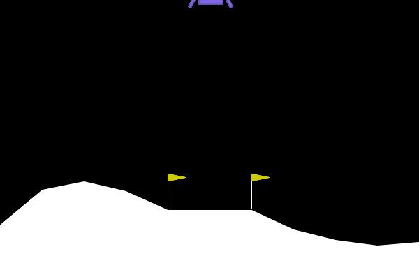
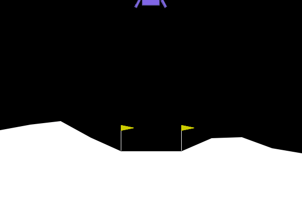
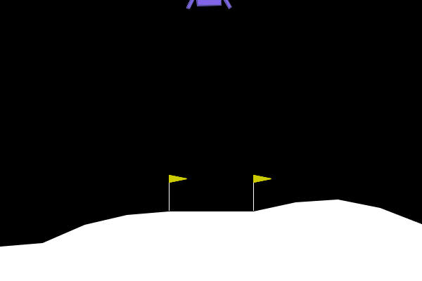
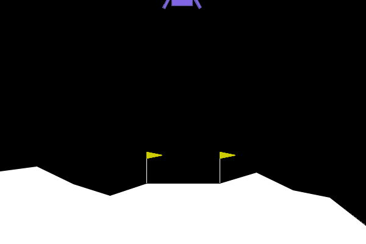
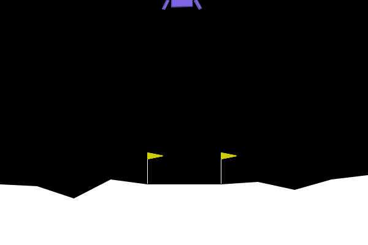

# AI Project: Lunar Lander

## Set up env

```bash
conda create -n lunar python=3.8
conda install swig
pip install gym[box2d]
# install pytorch you need
conda install -c ankurankan pgmpy # may be for Probabilistic Graphical Models
pip install tensorboard tensorboardX
```

## RL with ActorCritic

### Visual Results

#### After Training 200 Epochs


#### After Training 600 Epochs


#### After Training 1000 Epochs


### Test on 100 Epochs
```bash
mean: 90.56262718486646 std: 50.90599388292423 max: 196.7647751914238 min: -89.969924180479
```

## RL with QLearning

### Visual Results

#### After Training 20 Epochs


#### After Training 100 Epochs


### Test on 100 Epochs
```bash
mean: 225.14527054974315 std: 62.88393475576646 max: 299.080730952846 min: -91.00848452617487
```

## Reference

1. [https://aayala4.github.io/Lunar-Lander-Python/](https://aayala4.github.io/Lunar-Lander-Python/)
2. [https://github.com/nikhilbarhate99/Actor-Critic-PyTorch](https://github.com/nikhilbarhate99/Actor-Critic-PyTorch)